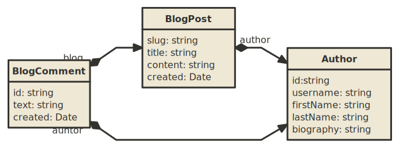

# daita-demo


## Installation instructions

```
npm install
npm run migrate
```


## Run api

```
npm start
```


## Configuration

| Name         | Description                                      | Default                   |
| ------------ | ------------------------------------------------ | ------------------------- |
| PORT         | port to serve api                                | 4000                      |
| JWT_SECRET   | JWT secret used to sign and verify bearer tokens | replace_me                |
| POSTGRES_URL | postgres connection string                       | postgres://localhost/blog |


## Tables



### Author
Contains all profile information about the author, gets created on first blog post or comment.

### BlogPost
Contains the content of the blog post and references the author and comments.

### BlogComment
A comment from a user about a blog post containing the reference of the creator.


## API resources

### GET /api/author

| Type  | Name  | Description                           | Default | Required |
| ----- | ----- | ------------------------------------- | ------- | -------- |
| query | skip  | Number of items to skip               | 20      | yes      |

### PUT /api/author/:id

| Type  | Name  | Description                           | Default | Required |
| ----- | ----- | ------------------------------------- | ------- | -------- |
| path  | id    | ID of the author                      | -       | yes      |

### GET /api/author/:id/blog

| Type  | Name  | Description                           | Default | Required |
| ----- | ----- | ------------------------------------- | ------- | -------- |
| path  | id    | ID of the author                      | -       | yes      |

### GET /api/author/:id/author

| Type  | Name  | Description                           | Default | Required |
| ----- | ----- | ------------------------------------- | ------- | -------- |
| path  | id    | ID of the author                      | -       | yes      |

GET /api/blog-post
POST /api/blog-post
PUT /api/blog-post/:slug
DELETE /api/blog-post/:slug

GET /api/blog-comment/:slug/comment
POST /api/blog-comment/:slug/comment

## Documentation
The documentation about daita is available [here](https://app.gitbook.com/@no0dles/s/daita/)
